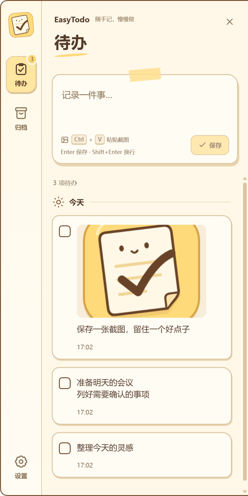
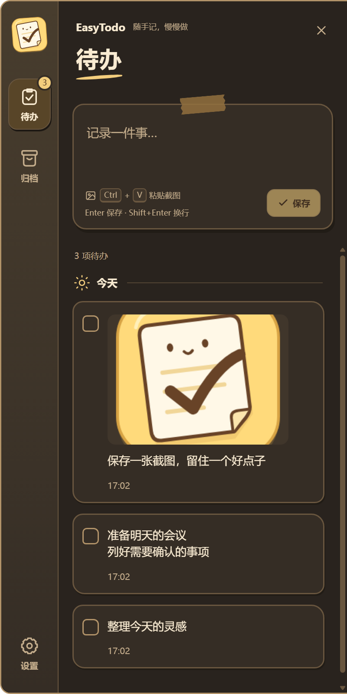
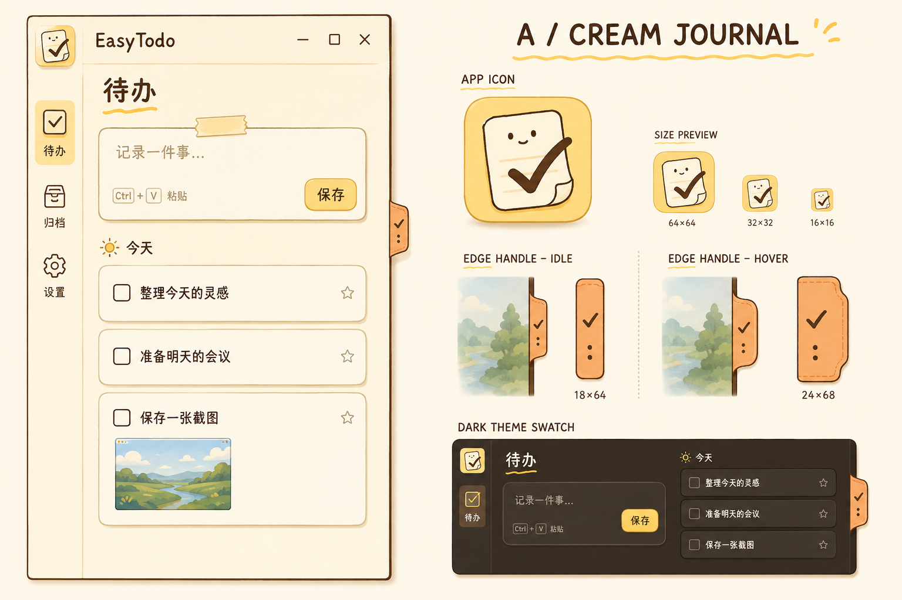

<div align="center">
  
  <h1>EasyTodo</h1>
  <p><strong>随手记，慢慢做。</strong></p>
  <p>一枚贴在屏幕边缘的小书签，一本随时打开的奶油手帐。<br />把文字、截图和临时灵感，轻轻放进今天的待办里。</p>
  <p>
    <a href="https://github.com/lwm98/EasyTodo/releases/tag/v1.0.0"></a>
    
    
    <a href="LICENSE"></a>
  </p>
  <p><a href="https://github.com/lwm98/EasyTodo/releases/download/v1.0.0/EasyTodo-Setup-1.0.0-x64.exe"><strong>下载 Windows 安装包</strong></a> · <a href="#应用界面">应用界面</a> · <a href="#开发与构建">开发与构建</a> · <a href="https://github.com/lwm98/EasyTodo/issues">反馈建议</a></p>
</div>

## 把小事记下来，把轻松留给自己

看到一段需要处理的文字、一张需要跟进的截图，或突然想到明天要做的事——唤起 EasyTodo，粘贴，按下 Enter。没有账号注册，也不需要先组织复杂的清单。

| 你需要的 | EasyTodo 的回应 |
| --- | --- |
| 随时记下一件事 | 全局快捷键直接聚焦输入框，`Enter` 保存 |
| 留住截图里的上下文 | 支持文字、图片、图片加说明；截图直接从剪贴板粘贴 |
| 少一点窗口切换 | 书签把手常驻最右侧显示器，悬停展开且不抢焦点 |
| 让待办列表保持清爽 | 按日期分组，完成即归档，支持撤销和恢复 |
| 一个舒服的桌面角落 | 奶油纸张、胶带便签、暖棕描边和笑脸图标，配套深色主题 |
| 自己掌握数据 | 无账号、无云端服务；待办与截图保存在本机 |

## 应用界面

下面是实际 Electron 应用运行截图，使用演示待办数据。

<table>
  <tr><th>奶油浅色</th><th>暖棕深色</th></tr>
  <tr>
    <td></td>
    <td></td>
  </tr>
</table>

### 设计参考

这张视觉设计图展示了新界面的风格方向：奶油手帐、笑脸清单图标和杏色书签把手。实际功能与布局以应用截图及下方说明为准；设计图中的星标等装饰不代表已实现的功能。



## 1.0.0 功能

- **快速记录**：输入文字、粘贴截图，或为图片补充说明；支持 PNG、JPEG、WebP、GIF，单张图片上限 25 MB。
- **边缘常驻**：杏色书签把手停靠最右侧显示器；悬停展开，移开且未处于输入或弹窗交互时自动收起。
- **键盘优先**：默认 `Ctrl+Alt+Space` 从任意应用打开并聚焦输入框；快捷键可在设置中修改。
- **完成与回顾**：待办按创建日期分组，完成后自动归档；提供 5 秒撤销入口，归档内容可恢复。
- **轻松整理**：双击文字编辑，双击图片放大；删除前二次确认，并同步清理对应图片文件。
- **主题联动**：浅色、深色、跟随系统三种模式，面板与书签把手同步切换。
- **桌面整合**：系统托盘、可选开机启动、单实例运行，以及显示器变化自动适配。
- **本地存储**：JSON 保存待办与设置，图片单独存放，无需配置数据库或服务器。

## 下载与使用

适用于 **Windows 10 / 11 x64**。直接下载安装包，无需安装 Node.js。

1. 在 [v1.0.0 Release](https://github.com/lwm98/EasyTodo/releases/tag/v1.0.0) 下载 `EasyTodo-Setup-1.0.0-x64.exe`。
2. 运行安装程序，选择安装目录；完成后从桌面或开始菜单打开 EasyTodo。
3. 将鼠标移到最右侧显示器中部的小书签，或按 `Ctrl+Alt+Space`。
4. 输入文字或 `Ctrl+V` 粘贴截图，按 `Enter` 保存。

关闭面板会回到屏幕边缘。需要完全退出时，在系统托盘右键菜单中选择“退出”。

| 快捷操作 | 效果 |
| --- | --- |
| 悬停右侧书签 | 展开面板，不抢当前应用焦点 |
| `Ctrl+Alt+Space` | 打开面板并聚焦输入框 |
| `Ctrl+V` | 粘贴文字或剪贴板图片 |
| `Enter` / `Shift+Enter` | 保存 / 换行 |
| 双击待办文字 / 图片 | 编辑 / 查看大图 |
| `Esc` | 关闭当前弹窗或隐藏面板 |

## 数据由你保管

应用不需要登录，核心功能可离线使用。数据保存在 Electron 的 `userData` 目录；1.0.0 默认位于 `%APPDATA%\EasyTodo`：

```text
EasyTodo/
├── todos.json    # 待办、归档内容与设置
└── images/       # 待办中的图片
```

备份时先从托盘退出应用，再复制 `todos.json` 和整个 `images` 文件夹。它们以普通本地文件保存，未做应用层加密。删除待办及其图片无法撤销，重要内容请定期备份。

如果从早期开发版迁移，旧数据可能在 `%APPDATA%\easy-todo`。退出应用后，可将上述文件复制到新目录；覆盖前请备份已有数据。

## 开发与构建

开发环境：**Windows x64、Node.js 22.12+、npm 10+**。

```powershell
git clone https://github.com/lwm98/EasyTodo.git
cd EasyTodo
npm ci
npm run dev
```

```powershell
# 类型检查与生产构建
npm run build

# 验证本地存储及真实 Electron 界面
npm run test:store
npm run test:ui

# 生成 Windows 安装包（仅构建，不自动发布）
npm run dist -- --publish never
```

安装包输出到 `release/EasyTodo-Setup-1.0.0-x64.exe`。界面测试使用独立测试数据，并刷新 `docs/preview.png` 与 `docs/preview-dark.png`。

| 技术 | 用途 |
| --- | --- |
| Electron 44 | 桌面窗口、托盘、全局快捷键与本地文件 |
| React 19 + TypeScript 7 | 待办、归档、设置和主题界面 |
| Vite 8 | 前端开发与构建 |
| electron-builder | Windows NSIS 安装包 |

```text
src/main/       # 窗口、IPC、本地存储
src/renderer/   # React 界面、主题、样式
assets/         # 共享 SVG 源图、应用与托盘图标
docs/           # 设计参考、实机截图和发行说明
scripts/        # 图标生成
tests/          # 存储与界面冒烟测试
```

## 参与贡献

欢迎通过 [Issues](https://github.com/lwm98/EasyTodo/issues) 提交问题与建议，或发起 Pull Request。反馈界面问题时，请附上 Windows 版本、缩放比例、主题和复现步骤。提交前运行构建与相关测试即可。

## 开源许可

EasyTodo 基于 [MIT License](LICENSE) 开源。

<div align="center"><sub>记录可以很快，生活可以慢一点。</sub></div>
